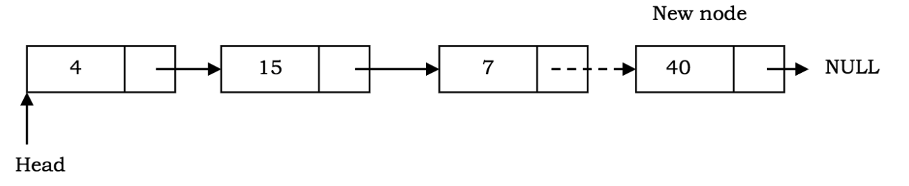

# 链表

## 什么是链表？

链表是数据元素的有序集合. 数据元素可以表示链表中的节点．每个节点由两部分组成：数据和指向下一个节点的指针．

与数组不同的地方在于数据元素不存储在连续的位置．数据元素或节点使用指针链接，因此成为链接列表．

## 链表具有以下属性：

+ 连续节点通过指针连接．
+ 最后一个节点指向空．
+ 头指针```head```指向链表的第一个节点．
+ 列表的长度随程序增加或收缩．
+ 可以根据需要制作
+ 它是随着列表的增长分配内存。与具有固定大小的数组不同，而且，必须预先知道元素数量的上限。
+ 链表通常与用途无关，分配的内存等于上限。这是在数组上使用链接列表的主要优点之一。

## 链表优点

与数据连续存储在内存中的数组相反，链表列表可以轻松地从列表中插入或删除节点，无需重新组织整个数据结构．

## 链表缺点

+ 不允许随机访问数据元素．必须从第一个节点开始顺序访问节点．因此，在链表上的搜索操作很慢．
+ 由于数组的指针使用了存储空间，因此它比数组使用更多的内存（使用更多的内存是为了存放指针）．

## 链表的类型

有几种不同类型的链表．但最受欢迎的是：单向链表，双向链表和循环链表

# 单向链表

单链表是节点的集合，其中每个节点具有２个部分：数据和指向下一个节点的指针．该列表以指向```null```的节点结尾．


链表上主要操作是：插入和删除

在详细介绍这两个操作之前，让我们定义一个链表节点类，并查看该节点类以及链接列表类如何帮助构建线性节点列表。

## 链表节点类

```JavaScript
export default class LinkedListNode {
  // 第一个值data就是节点存储的值, 第二个next是指针(指向下一个节点) 默认为null
  constructor(data, next = null) {
    this.data = data;
    this.next = next;
  }
}
```

## 链表类

```JavaScript
export default class LinkedList {
  constructor() {
    // 初始化链表时 head头部为空
    this.head = null;
  }
}
```

如果我们要创建LinkedList类的实例, 直接new一个就可以了

```JavaScript
// 创建一个带有属性head的列表对象, 当前指向null
let list = new LinkedList();
```

在创建节点类和链表类之后，现在让我们看一下对单个链接列表执行的插入和删除操作。

## 单向链表插入操作

插入操作会将节点插入列表。插入操作可能有三种情况:

+ 在链表头（链表的开头）之前插入一个新节点
+ 在链表尾部之后（即链表的末尾）插入一个新节点
+ 在链表中间（在给定的随机位置）插入一个新节点

### 在单链表头（链表的开头）之前插入一个新节点

在这种情况下，将在当前头节点之前添加一个新节点。为了完成此操作，我们将首先创建一个节点。新创建的节点将具有Node类的构造函数中定义的两个属性，即data和next。

```JavaScript
export default class LinkedList {
  constructor() {
    // 初始化链表时 head头部为空
    this.head = null;
  }

  insertAtBeginning (data) {
    // 创建一个节点并且next = null
    let newNode = new LinkedListNode(data);
    // 当前头部的节点赋值给新节点的next,两者的节点都指向相同的节点
    newNode.next = this.head;
    // 当前头部的节点next指向新节点
    this.head = newNode;
    return this.head;
  }
}
```


### 在单链表的末尾插入一个节点

在这种情况下，新节点将添加到列表的末尾。要实现此操作，我们将必须遍历列表以找到尾节点，并修改尾的下一个指针以指向新创建的节点，而不是null。

最初，列表为空，并且标题指向空。

```JavaScript
export default class LinkedList {
  insertAtEnd(data) {
    let newNode = new LinkedListNode(data);
    // 当head = null时, 代表是个空链表, 所以head会指向新增的节点
    if (!this.head) {
      this.head = newNode;
      return this.head;
    }
    // 否则，遍历链表以找到尾部（尾部节点最初将指向空），并更新尾部的下一个指针。
    let tail = this.head;
    while (tail.next !== null) {
      tail = tail.next;
    }
    tail.next = newNode;

    return this.head;
  }
}
```

.")



### 在单链表中指定位置插入节点

要执行此操作，我们将必须遍历列表，直到到达所需的位置节点为止。然后，我们将newNode的下一个指针分配给位置节点的下一个节点。然后可以更新位置节点的下一个指针以指向newNode。


```JavaScript
export default class LinkedList {
  // 定义了一个辅助函数getAt（）到达所需位置。此功能以后也可以用于从给定位置执行删除操作。
  getAt (index) {
    let counter = 0;
    let node = this.head;
    // 循环链表
    while (node) {
      // 如果当前counter等于指定的index, 则返回当前节点
      if (counter === index) {
        return code;
      }
      // 如果不等于,则++,并且指向下个节点
      counter++;
      node = node.next;
    }
    // 否则返回null
    return null;
  }

  insertAt (data, index) {
    // 如果为空链表
    if (!this.head) {
      this.head = new LinkedListNode(data);
      return;
    }
    // 如果插入的index是链表的最前面
    if (index === 0) {
      // 新增一个节点, 该节点的next指向head.next, head指向新增节点
      this.head = new LinkedListNode(data, this.head);
      return;
    }
    // 否则, 使用getAt()找到指定位置节点的上一个节点
    const previous = this.getAt(index - 1);
    // 新增节点
    let newNode = new LinkedListNode(data);
    // 新增节点的指针指向上一个节点的指针
    newNode.next = previous.next;
    // 上一个节点的指针指向新增节点
    previous.next = newNode;

    return this.head;
  }
}
```

### 对单链表的删除操作

删除操作将从列表中删除一个节点. 删除操作可能有三种情况.

+ 删除第一个节点
+ 删除最后一个节点
+ 删除指定节点

#### 删除第一个节点

```JavaScript
export default class LinkedList {
  deleteFirstNode() {
    // 如果链表为空, 则直接返回
    if (!this.head) {
      return;
    }
    // 否则头部节点的下一个节点做为头部节点
    this.head = this.head.next;
    return this.head;
  }
}
```

#### 删除最后一个节点

要从链表中删除最后一个节点，我们首先必须遍历链表以找到最后一个节点，同时还要保留一个额外的指针以指向最后一个节点之前的节点。要删除最后一个节点，我们将把最后一个节点之前的节点的下一个指针设置为null。


```JavaScript
export default class LinkedList {
  deleteLastNode() {
    // 如果链表为空, 则直接返回
    if (!this.head) {
      return;
    }
    // 如果只有一个节点
    if (!this.head.next) {
      // 则直接赋予当前head为null
      this.head = null;
      return;
    }
    let previous = this.head;
    let tail = this.head.next;

    // 循环链表, 如果不等于空则一直循环, 直到找到最后的节点, 指向为null的节点
    while (tail.next !== null) {
      previous = tail;
      tail = tail.next;
    }

    // 最后的前一个节点的指向为null
    previous.next = null;
    return this.head;
  }
}
```

#### 在单链表中删除指定位置的节点

与上述情况类似，我们将首先必须遍历列表以找到要删除的所需节点，同时还要保留一个额外的指针，以指向所需节点之前的节点。


```JavaScript
export default class LinkedList {
  deleteAt(index) {
    // 如果链表为空, 则直接返回
    if (!this.head) {
      return;
    }
    // 如果删除节点为头部节点
    if (index === 0) {
      // 则直接赋予当前head的指向等于head
      this.head = this.head.next;
      return;
    }
    // 否则使用getAt()得到指定位置节点的前一个节点
    const previous = this.getAt(index - 1);
    // 如果指定位置没有该节点,则直接返回
    if (!previous || !previous.next) {
      return;
    }
    // 前一个节点的指向指向于前一个节点的后两个节点
    previous.next = previous.next.next;
    return this.head;
  }
}
```

#### 删除链表

只需要一行代码... 把head指向为null...

```JavaScript
export default class LinkedList {
  deleteList() {
    this.head = null;
  }
}
```

这里有些朋友可能会疑惑? 按照书上c所写的删除链表某一项通常都会释放内存, 为什么在这里就没有展示?

那是因为JavaScript本身自带有垃圾回收机制, 函数运行时变量才会申请使用内存(变量只是存储内存的指针), 当函数结束的时候, 所占用的内存都会被释放.

# 双向链表

双向链表跟普通链表的区别在于, 链接是双向的:一个链向下一个元素， 另一个链向前一个元素. 如图所示:


实现一个双向链表类:

```JavaScript
// 链表节点
class Node {
  constructor(data) {
    this.data = data;
    this.prev = null;
    this.next = null;
  }
}

// 双向链表
class DoublyLinkedList {
  constructor() {
    this.head = null;
    this.tail = null;
    this.length = 0;
  }

  // 任意位置插入元素
  insert(index, data) {
    if (index >= 0 && index <= this.length){
      const node = new Node(data);
      let current = this.head;
      let previous = null;
      let index = 0;
      // 首位
      if (index === 0) {
        if (!head){
          this.head = node;
          this.tail = node;
        } else {
          node.next = current;
          this.head = node;
          current.prev = node;
        }
        // 末位
      } else if (index === this.length) {
        current = this.tail;
        current.next = node;
        node.prev = current;
        this.tail = node;
        // 中位
      } else {
        while (index++ < index) {
          previous = current;
          current = current.next;
        }
        node.next = current;
        previous.next = node;
        current.prev = node;
        node.prev = previous;
      }
      this.length++;
      return true;
    }
    return false;
  }

    // 移除指定位置元素
  removeAt(index) {
    if (index > -1 && index < this.length) {
      let current = this.head;
      let previous = null;
      let index = 0;

      // 首位
      if (index === 0) {
        this.head = this.head.next;
        this.head.prev = null;
        if (this.length === 1) {
          this.tail = null;
        }

        // 末位
      } else if (index === this.length - 1) {
        this.tail = this.tail.prev;
        this.tail.next = null;

        // 中位
      } else {
        while (index++ < index) {
          previous = current;
          current = current.next;
        }
        previous.next = current.next;
        current.next.prev = previous;
      }
      this.length--;
      return current.data;
    } else {
      return null;
    }
  }

  // 其他方法...
}
```
