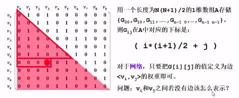

# 图

## 怎么在程序中表示一个图

有以下几种方法：

- 邻接矩阵
  - 有什么好？
    - 直观、简单、好理解
    - 方便检查任意一对顶点是否存在边
    - 方便找任一顶点的所有“邻接点”（有边直接相连的顶点）
    - 方便计算任一顶点的“度”（从该点发出的边数为“出度”，指向该点的边数为“入度”）
      - 无向图：对应行（或列）非0元素的个数
      - 有向图：对应行非0元素的个数是“出度”；对应列非0元素的个数为“入度”
  - 有什么不好？
    - 浪费空间 —— 存稀疏图（点很多而边很少）就会有大量无效元素
      - 对稠密图（特别是完全图）还是很合算的
    - 浪费时间 —— 统计稀疏图中一共有多少条边

用一个二维数组来表示，G[N][N] —— N个顶点从0到N-1编号

如果<vi, vj>是G中的边，则G[i][j]为1 否则为0

- 邻接表
  - 方便找任一顶点的所有“邻接点”
  - 节约稀疏图的空间
    - 需要N个头指针 + 2E个节点（每个节点至少2个域）
  - 方便计算任一顶点的“度”？
    - 对无向图：是的
    - 对有向图：只能计算“出度”：需要构造“邻接表”（存指向自己的边）来方便计算“入度”

邻接表：G[N]为指针数组，对应矩阵每行一个链表，只存非 0 元素。例如： 0 这个顶点上有 1 和 3 这两个元素

## 深度优先搜索（DFS）

时间复杂度：

- 用邻接表存储图，有O(N+E)
- 用邻接矩阵存储图，有O(N^2)

## 广度优先搜索（BFS）

时间复杂度：

- 用邻接表存储图，有O(N+E)
- 用邻接矩阵存储图，有O(N^2)

## 为什么需要两种遍历

所解决的问题角度不同

以下以一个出迷宫的例子来说，假设：有一个人想走出迷宫，白色格子是可以行走的道路，黑色则是封闭的道路，出口是绿色的格子。

在深度优先搜索（DFS）中需要遍历这么多次才能找到

但是在广度优先搜索（BFS）则只需要这么少次就能找到。广度优先搜索是以一个圆为中心遍历

如果把出口换到右下角

则BFS不爽了

## 比较DFS和BFS的优点和缺点

BFS：对于解决最短或最少问题特别有效，而且寻找深度小，但缺点是内存耗费量大（需要开大量的数组单元来存储状态）。

DFS：对于解决遍历和求所有问题有效，对于问题搜索深度小的时候处理速度迅速，然而在深度很大的情况下效率不高。
