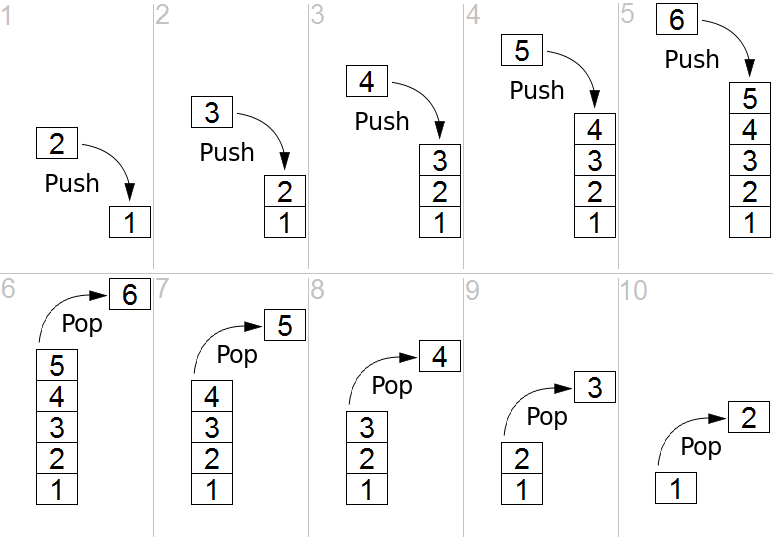

# 队列(Queue)

[队列具体实现(Queue)](Queue.js)

Queue和Stack有一些类似,不同的是Stack是先进后出,而Queue是先进先出. Queue在生活中的例子: 在饭堂排队领餐吃饭, 排在第一个的总是最先能领到餐; 又比如打印机的打印队列, 排在前面的最先打印.



Queue一般具有以下方法:

1. enqueue: 入列, 向队列尾部增加一个元素
2. dequeue: 出列, 移除队列头部的一个元素并返回被移除的元素
3. peek: 获取队列的第一个元素
4. isEmpty: 判断队列是否为空

## 其实栈就是单链表的另一种实现方法

```JavaScript
import LinkedList from '../linked-list/LinkedList';

class Stack {
  constructor() {
    this.linkedList = new LinkedList();
  }

  /**
   * @return {boolean}
   */
  isEmpty() {
    // 如果这个单链表没有表头, 那么代表这个栈为空
    return !this.linkedList.head;
  }

  /**
   * @return {*}
   */
  peek() {
    if (!this.linkedList.head) {
      return null;
    }

    return this.linkedList.head.value;
  }

  /**
   * 在链表尾部添加一个元素
   * @param {*} value
   */
  enqueue(value) {
    this.linkedList.append(value);
  }

  /**
   * 删除队列开头（链表的开头）中的元素。
   * 如果链表为空, 返回 null.
   * @return {*}
   */
  dequeue() {
    const removedHead = this.linkedList.deleteHead();
    return removedHead ? removedHead.value : null;
  }
}
```

## 队列存储的方式就是单链表的内存存储方式

## 参考资料

[javascript-algorithms](https://github.com/trekhleb/javascript-algorithms/blob/master/src/data-structures/queue/Queue.js)
