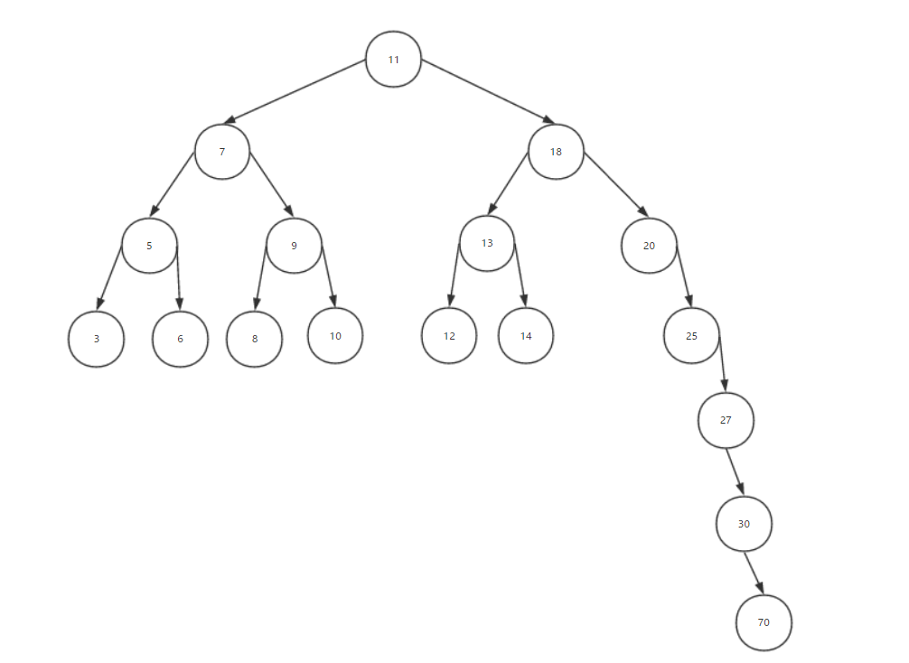

# AVL树(avl-tree)

在计算机科学中, AVL树(以发明家Adelson-Velsky和Landis的名字命名)是一颗自平衡二叉搜索树. 这是第一个被发明的数据结构, 通俗点来说就是二叉高度平衡搜索树.



假如数据量大, 那么我们在某条边上增删改查的操作时, 就像在一条有序的链表上操作, 就会消耗大量的时间. 这就需要另外一种的树来解决这样的问题, 所以也就有了自平衡二叉搜索树.

在AVL树中, 任何节点的两个子树的高度最多相差一个, 在任意时间内假如它们之间的差超过一个, 那么将进行重新平衡以恢复该平衡属性.

在平均和最坏情况下， 查找, 插入和删除都需要 ```O（log n）``` 时间, 其中n是操作树中的节点数.

在下面动画中显示了将几个元素插入到AVL树中. 它包括左，右，左右和左右旋转操作.


## AVL树一般有以下操作

- 插入一个节点
- 删除某个节点
- 平衡节点
- 左左旋转
- 左右旋转
- 右左旋转
- 右右旋转

```JavaScript
// 引入二叉搜索树
import BinarySearchTree from '../binary-search-tree/BinarySearchTree';

export default class AvlTree extends BinarySearchTree {
  /**
   * @param {*} value
   */
  insert(value) {
    // 执行插入二叉搜索树
    super.insert(value);

    // 向上移动并检查平衡因子
    let currentNode = this.root.find(value);
    while (currentNode) {
      this.balance(currentNode);
      currentNode = currentNode.parent;
    }
  }

  /**
   * @param {*} value
   * @return {boolean}
   */
  remove(value) {
    // 执行删除二叉搜索树的指定节点
    super.remove(value);

    // 从根节点往下平衡节点
    this.balance(this.root);
  }

  /**
   * @param {BinarySearchTreeNode} node
   */
  balance(node) {
    // 如果平衡系数不正确，则尝试平衡该节点。
    if (node.balanceFactor > 1) {
      // 左旋转.
      if (node.left.balanceFactor > 0) {
        // 左左旋转
        this.rotateLeftLeft(node);
      } else if (node.left.balanceFactor < 0) {
        // 左右旋转
        this.rotateLeftRight(node);
      }
    } else if (node.balanceFactor < -1) {
      // 右旋转
      if (node.right.balanceFactor < 0) {
        // 右右旋转
        this.rotateRightRight(node);
      } else if (node.right.balanceFactor > 0) {
        // 右左旋转
        this.rotateRightLeft(node);
      }
    }
  }

  /**
   * @param {BinarySearchTreeNode} rootNode
   */
  rotateLeftLeft(rootNode) {
    // 从根节点分离左节点, 存储根节点左部分
    const leftNode = rootNode.left;
    // 设置根节点的左部分为null
    rootNode.setLeft(null);

    // 使左节点成为rootNode的父级的子级.
    if (rootNode.parent) {
      rootNode.parent.setLeft(leftNode);
    } else if (rootNode === this.root) {
      // 如果根节点是根节点，则使左节点成为新的根节点
      this.root = leftNode;
    }

    // 如果左节点有一个右子节点，则分离它并将其作为rootNode的左子节点附加
    if (leftNode.right) {
      rootNode.setLeft(leftNode.right);
    }

    // 将rootNode附加到leftNode的右侧
    leftNode.setRight(rootNode);
  }

  /**
   * @param {BinarySearchTreeNode} rootNode
   */
  rotateLeftRight(rootNode) {
    // Detach left node from rootNode since it is going to be replaced.
    const leftNode = rootNode.left;
    rootNode.setLeft(null);

    // Detach right node from leftNode.
    const leftRightNode = leftNode.right;
    leftNode.setRight(null);

    // Preserve leftRightNode's left subtree.
    if (leftRightNode.left) {
      leftNode.setRight(leftRightNode.left);
      leftRightNode.setLeft(null);
    }

    // Attach leftRightNode to the rootNode.
    rootNode.setLeft(leftRightNode);

    // Attach leftNode as left node for leftRight node.
    leftRightNode.setLeft(leftNode);

    // Do left-left rotation.
    this.rotateLeftLeft(rootNode);
  }

  /**
   * @param {BinarySearchTreeNode} rootNode
   */
  rotateRightLeft(rootNode) {
    // Detach right node from rootNode since it is going to be replaced.
    const rightNode = rootNode.right;
    rootNode.setRight(null);

    // Detach left node from rightNode.
    const rightLeftNode = rightNode.left;
    rightNode.setLeft(null);

    if (rightLeftNode.right) {
      rightNode.setLeft(rightLeftNode.right);
      rightLeftNode.setRight(null);
    }

    // Attach rightLeftNode to the rootNode.
    rootNode.setRight(rightLeftNode);

    // Attach rightNode as right node for rightLeft node.
    rightLeftNode.setRight(rightNode);

    // Do right-right rotation.
    this.rotateRightRight(rootNode);
  }

  /**
   * @param {BinarySearchTreeNode} rootNode
   */
  rotateRightRight(rootNode) {
    // Detach right node from root node.
    const rightNode = rootNode.right;
    rootNode.setRight(null);

    // Make right node to be a child of rootNode's parent.
    if (rootNode.parent) {
      rootNode.parent.setRight(rightNode);
    } else if (rootNode === this.root) {
      // If root node is root then make right node to be a new root.
      this.root = rightNode;
    }

    // If right node has a left child then detach it and
    // attach it as a right child for rootNode.
    if (rightNode.left) {
      rootNode.setRight(rightNode.left);
    }

    // Attach rootNode to the left of rightNode.
    rightNode.setLeft(rootNode);
  }
}
```

## 复杂度

### 时间复杂度

| Access    | Search    | Insertion | Deletion  |
| :-------: | :-------: | :-------: | :-------: |
| O(log(n)) | O(log(n)) | O(log(n)) | O(log(n)) |

### 空间复杂度

O(n)

## 自平衡二叉搜索树的使用场景

1. 特别是用于查找密集型应用程序，例如，它用于索引数据库中的大记录以改善搜索
2. 如果您正在设计一些数据库，在该数据库中插入和删除不那么频繁，但是您必须经常查找那里的项目，那么AVL树是很有用的
3. 词典
4. windows对进程地址空间的管理用到了AVL

## 参考资料

[用js来实现那些数据结构14（树02-AVL树）](https://www.cnblogs.com/zaking/p/8976362.html)
