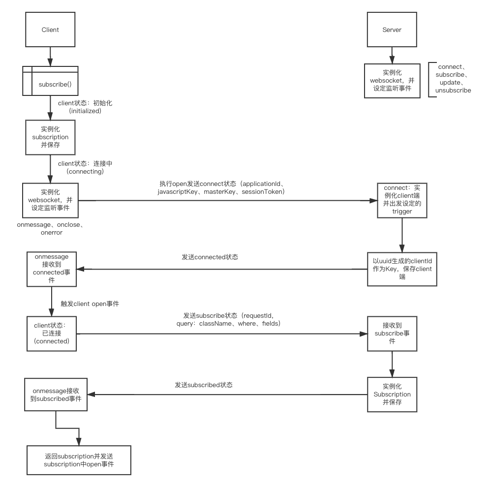

# LiveQuery实现原理

## 目录

- [LiveQuery实现原理](#livequery实现原理)
  - [目录](#目录)
  - [socket建立连接流程](#socket建立连接流程)
    - [流程图](#流程图)
    - [源码分析](#源码分析)
      - [客户端](#客户端)
      - [服务端](#服务端)
  - [总结](#总结)

## socket建立连接流程

### 流程图

先来一张整体的流程图

;

### 源码分析

#### 客户端

当执行Parse.Query中的subscribe时

```typescript
  /**
   * Subscribe this query to get liveQuery updates
   *
   * @param {string} sessionToken (optional) Defaults to the currentUser
   * @returns {Promise<LiveQuerySubscription>} Returns the liveQuerySubscription, it's an event emitter
   * which can be used to get liveQuery updates.
   */
  async subscribe(sessionToken?: string): Promise<LiveQuerySubscription> {
    // 没传sessiontoken则默认取当前用户的session
    const currentUser = await CoreManager.getUserController().currentUserAsync();
    if (!sessionToken) {
      sessionToken = currentUser ? currentUser.getSessionToken() : undefined;
    }
    // 在Parse源码中，作者很喜欢把所有的对象方法都放在CoreManager，这里获取默认的liveQueryClient
    // 这里的liveQueryClient（以下统称client）是websocket（以下统称ws）的载体
    // 注：可以自定义client
    const liveQueryClient = await CoreManager.getLiveQueryController().getDefaultLiveQueryClient();
    // 获取当前client状态是否可以开启
    if (liveQueryClient.shouldOpen()) {
      // 开启ws客户端
      liveQueryClient.open();
    }
    const subscription = liveQueryClient.subscribe(this, sessionToken);
    // 等待功能完成才返回subscription
    return subscription.subscribePromise.then(() => {
      return subscription;
    });
  }
```

liveQueryClient.open事件：

```typescript
open() {
    const WebSocketImplementation = CoreManager.getWebSocketController();
    if (!WebSocketImplementation) {
      this.emit(CLIENT_EMMITER_TYPES.ERROR, 'Can not find WebSocket implementation');
      return;
    }

    if (this.state !== CLIENT_STATE.RECONNECTING) {
      this.state = CLIENT_STATE.CONNECTING;
    }

    // 注册ws服务，ws服务可自定义
    this.socket = new WebSocketImplementation(this.serverURL);

    // 绑定ws回调
    this.socket.onopen = () => {
      // 一、打开ws客户端就发送消息 
      // connect状态、applicationId、javascriptKey、masterKey、sessionToken
      this._handleWebSocketOpen();
    };

    this.socket.onmessage = event => {
      // 监听回调回来的message信息
      this._handleWebSocketMessage(event);
    };

    this.socket.onclose = () => {
      this._handleWebSocketClose();
    };

    this.socket.onerror = error => {
      this._handleWebSocketError(error);
    };
  }
```

Parse-SDK-JS/src/LiveQueryClient.js

```typescript
_handleWebSocketMessage(event: any) {
    let data = event.data;
    if (typeof data === 'string') {
      data = JSON.parse(data);
    }
    let subscription = null;
    if (data.requestId) {
      subscription = this.subscriptions.get(data.requestId);
    }
    const response = {
      clientId: data.clientId,
      installationId: data.installationId,
    };
    switch (data.op) {
    case OP_EVENTS.CONNECTED:
      // 三、接收到服务端返回来的connected状态
      if (this.state === CLIENT_STATE.RECONNECTING) {
        this.resubscribe();
      }
      // 触发client的open时间，注意这里和subscription不是同一个
      this.emit(CLIENT_EMMITER_TYPES.OPEN);
      this.id = data.clientId;
      // 这里resolve是执行ws客户端发送消息
      // subscribe状态，requestId，query：className、where、fields
      this.connectPromise.resolve();
      this.state = CLIENT_STATE.CONNECTED;
      break;
    case OP_EVENTS.SUBSCRIBED:
      // 五、接收到服务端返回来的subscribed状态
      if (subscription) {
        subscription.subscribed = true;
        // 这里resolve是前端执行通过subscribe()返回subscription
        subscription.subscribePromise.resolve();
        // 触发subscription中的open事件
        setTimeout(() => subscription.emit(SUBSCRIPTION_EMMITER_TYPES.OPEN, response), 200);
      }
      break;
    case OP_EVENTS.ERROR:
      // 错误处理
      if (data.requestId) {
        if (subscription) {
          subscription.subscribePromise.resolve();
          setTimeout(() => subscription.emit(SUBSCRIPTION_EMMITER_TYPES.ERROR, data.error), 200);
        }
      } else {
        this.emit(CLIENT_EMMITER_TYPES.ERROR, data.error);
      }
      if (data.error === 'Additional properties not allowed') {
        this.additionalProperties = false;
      }
      if (data.reconnect) {
        this._handleReconnect();
      }
      break;
    case OP_EVENTS.UNSUBSCRIBED:
      // We have already deleted subscription in unsubscribe(), do nothing here
      break;
    default: {
      // 触发以下事件
      // create, update, enter, leave, delete cases
      ...
      if (data.original) {
        subscription.emit(data.op, parseObject, data.original, response);
      } else {
        subscription.emit(data.op, parseObject, response);
      }

      const localDatastore = CoreManager.getLocalDatastore();
      if (override && localDatastore.isEnabled) {
        localDatastore._updateObjectIfPinned(parseObject).then(() => {});
      }
    }
    }
  }
```

#### 服务端

当在服务端设置了liveQuery并且执行了createLiveQueryServer，他会实例化ParseLiveQueryServer

```javascript
let api = new ParseServer({
  ...,
  liveQuery: {
    classNames: ['Test', 'TestAgain']
  }
});
```

parse-server/src/LiveQuery/ParseLiveQueryServer.js

```javascript
class ParseLiveQueryServer {
  ...
  constructor(server: any, config: any = {}, parseServerConfig: any = {}) {
    ...
    // 初始化ws服务端、ws服务端可自定义
    this.parseWebSocketServer = new ParseWebSocketServer(
      server,
      // _onConnect是处理ws连接
      parseWebsocket => this._onConnect(parseWebsocket),
      config
    );

    // Initialize subscriber
    // ParsePubSub是一个发布订阅工具，位于parse-server/src/Adapters/PubSub/EventEmitterPubSub.js，该发布订阅工具也是可以自定义的
    // 创建全局的订阅者，并订阅afterSave、afterDelete事件
    // 当一个class被创建或者修改的时候都会走parse-server/src/RestWrite.js，在class被创建或者修改的时候，RestWrite其中一个钩子函数runAfterSaveTrigger会发布消息通知这里，这里会做权限ACL过滤、query过滤、appId过滤等，最后才去执行ws服务端通知到每个ws客户端消息
    // 
    this.subscriber = ParsePubSub.createSubscriber(config);
    this.subscriber.subscribe(Parse.applicationId + 'afterSave');
    this.subscriber.subscribe(Parse.applicationId + 'afterDelete');
  }

  _onConnect(parseWebsocket: any): void {
    parseWebsocket.on('message', request => {
      ...
      switch (request.op) {
        case 'connect':
          // 二、接收到client端发过来connect状态的数据
          // 创建在服务端的client，触发对应beforeConnect钩子，创建完成发送connected消息到客户端
          // 该client是引用上面的ws发送消息，负责推送消息到客户端
          this._handleConnect(parseWebsocket, request);
          break;
        case 'subscribe':
          // 四、接收到client端发过来subscribe状态的数据
          // 触发beforeSubscribe钩子、创建在服务端的subscription、创建完成发送subscribed、requestId消息到客户端、触发subscribe钩子
          this._handleSubscribe(parseWebsocket, request);
          break;
        case 'update':
          this._handleUpdateSubscription(parseWebsocket, request);
          break;
        case 'unsubscribe':
          this._handleUnsubscribe(parseWebsocket, request);
          break;
        default:
          Client.pushError(parseWebsocket, 3, 'Get unknown operation');
          logger.error('Get unknown operation', request.op);
      }
    });
  }
  ...
}
```

## 总结

在websocket连接中做了不少封装，包括连接状态管理、数据互通、权限校验、自动重连等等。让前端开发者快速上手并能实现到功能。

每个订阅的className，当一个class更新了，会通知到全部客户端更新，让前端进行判断更新，当时还觉得这样不合理，应该是找出需要更新的客户端才更新，但细想了下其实这样做才是最快最合理的。因为后端需要筛选这大批量数据，再筛选出对应的客户端通知信息，这过程消耗远比前端判断来得直接和快。
